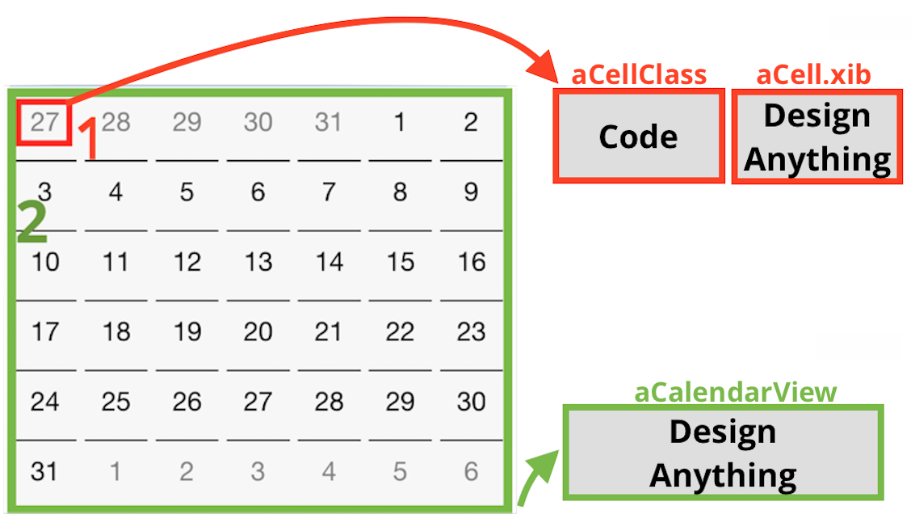
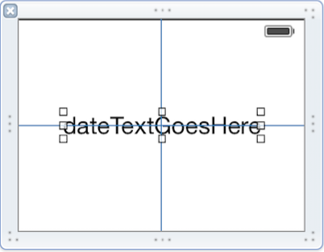
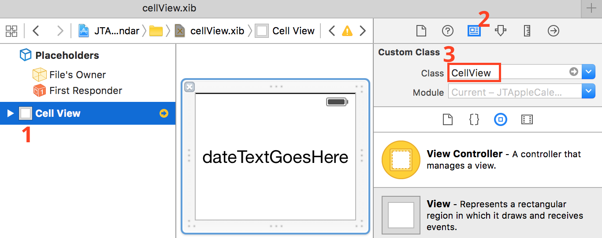

[](https://travis-ci.org/JayT/JTAppleCalendar) [](http://cocoapods.org/pods/JTAppleCalendar) [](http://cocoapods.org/pods/JTAppleCalendar) [](http://cocoapods.org/pods/JTAppleCalendar)

JTAppleCalendar is the final iOS calendar control you will ever try.

### **Features**
---

<li class="task-list-item"><input class="task-list-item-checkbox" checked="checked" disabled="disabled" type="checkbox"> <B>Boundary dates</B> - limit the calendar range to your liking</li>
<li class="task-list-item"><input class="task-list-item-checkbox" checked="checked" disabled="disabled" type="checkbox"> <B>Week/month mode</B> - show 1 row of weekdays. Or 2, 3, 4 or 6</li>
<li class="task-list-item"><input class="task-list-item-checkbox" checked="checked" disabled="disabled" type="checkbox"> <B>Custom cells</B> - make your day-cells look however you want, with what ever functionality you want</li>
<li class="task-list-item"><input class="task-list-item-checkbox" checked="checked" disabled="disabled" type="checkbox"> <B>Custom calendarView</B> - make your calendar look however you want, with what ever functionality you want</li>
<li class="task-list-item"><input class="task-list-item-checkbox" checked="checked" disabled="disabled" type="checkbox"> <B>First Day of week</B> - pick anyday to be first day of the week</li>
<li class="task-list-item"><input class="task-list-item-checkbox" checked="checked" disabled="disabled" type="checkbox"> <B>Ability to add custom functionality easily</B> - change the color of weekends, customize days according to data in your data-source. You want it, you build it</li>

<li class="task-list-item"><input class="task-list-item-checkbox" checked="checked" disabled="disabled" type="checkbox"> <a href="https://github.com/patchthecode/JTAppleCalendar">Complete Documentation</a></li>


### **Requirements**
---

* iOS 8.0+ 
* Xcode 7.2+


### **Communication**
---
* If you found a bug, open an issue.
* If you have a feature request, open an issue.


### **Installation using CocoaPods**

CocoaPods is a dependency manager for Cocoa projects. You can install it with the following command:

    $ gem install cocoapods


> CocoaPods 0.39.0+ is required to build JTAppleCalendar

To integrate Alamofire into your Xcode project using CocoaPods, specify it in your Podfile:

    platform :ios, '8.0'
    use_frameworks!

    pod 'JTAppleCalendar', '~> 1.0'

Then, run the following command at your project location:

    $ pod install

### **The Problem**
---

1. Apple has no calendar control.
2. Other calendar projects on Github try to cram every feature into their control, hoping it will meet the programmer's requirements.

This is an incorrect way to build controls. Do you see Apple building their `UITableView` by guessing what they think you want the UITableView to look like? No. So neither should we. 

### **The Solution: JTAppleCalendar**
---

#### How to setup the calendar - Quick tutorial

JTAppleCalendar is similar to setting up a UITableView with a custom cell.



There are two parts
##### 1. The cell
---
Like a UITableView, the cell has 2 parts. 

* First let's create a new xib file. I'll call mine *CellView.xib*. I will setup the bare minimum; a single `UILabel` to show the date. It will be centered with Autolayout constraints. 

> Do you need more views setup on your cell like: dots, animated selection view, custom images etc? No problem. Design the cell however you want. This repository has sample code which demonstrates how you can do this easily.





* Second , create a custom class for the xib. The new class must be a subclass of `JTAppleDayCellView`. I called mine *CellView.swift*.  Inside the class setup the following:

~~~swift
import JTAppleCalendar 
class CellView: JTAppleDayCellView {
   @IBOutlet var dayLabel: UILabel!
}
~~~

* Finally head back to your *cellView.xib* file and make the outlet connections.
    - First,  select the view for the cell
    - Second, click on the identity inspector
    - Third, change the name of the class to one you just created: *CellView*
    - Then connect your UILabel to your `dayLabel` outlet



##### 2. The calendarView
---
* This step is easy. Go to your Storyboard and add a `UIView` to it. Set the class of the view to be `JTAppleCalendarView`. Then setup an outlet for it to your viewController. 


##### Whats next?
Similar to UITableView, your viewController has to conform to 2 protocols for it to work

* JTAppleCalendarViewDataSource
~~~swift
// This method is required. You provide a startDate, endDate, and a calendar configured to your liking.
func configureCalendar() -> (startDate: NSDate, endDate: NSDate, calendar: NSCalendar)
~~~
* JTAppleCalendarViewDelegate 
~~~swift
// These methods are optional. And are self descriptive	
func calendar(calendar : JTAppleCalendarView, canSelectDate date : NSDate, cell: JTAppleDayCellView, cellState: CellState) -> Bool
func calendar(calendar : JTAppleCalendarView, canDeselectDate date : NSDate, cell: JTAppleDayCellView, cellState: CellState) -> Bool
func calendar(calendar : JTAppleCalendarView, didSelectDate date : NSDate, cell: JTAppleDayCellView, cellState: CellState) -> Void
func calendar(calendar : JTAppleCalendarView, didDeselectDate date : NSDate, cell: JTAppleDayCellView?, cellState: CellState) -> Void
func calendar(calendar : JTAppleCalendarView, didScrollToDateSegmentStartingWith date: NSDate?, endingWithDate: NSDate?) -> Void
func calendar(calendar : JTAppleCalendarView, isAboutToDisplayCell cell: JTAppleDayCellView, date:NSDate, cellState: CellState) -> Void
~~~


JTAppleCalendar is available through [CocoaPods](http://cocoapods.org). To install
it, simply add the following line to your Podfile:

```ruby
pod "JTAppleCalendar"
```

## Author

JayT, patchthecode@gmail.com

## License

JTAppleCalendar is available under the MIT license. See the LICENSE file for more info.
